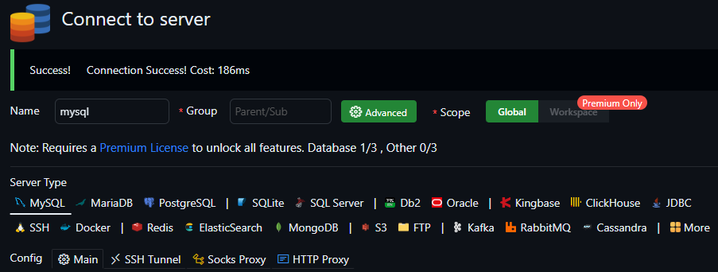

# はじめに
MySQLを使ったSQLや実行計画を学習するためのリポジトリです。

## 利用上の注意
- `Github`の`Codespace`を利用します。`Codespace`は設定によってはコストがかかるものなので [Codespaceの利用上の注意](#Codespaceの利用上の注意) はよく確認してください。
- コストをかけないためにも、セキュリティの意味でも、使い終わったら [停止方法](#停止方法) に従って停止することを推奨します。
- パスワードは各自考えてください。また、間違えてメモなどをコミットしないように気を付けてください。

## 使い方
※ ローカルで`docker-compose.yml`を起動する場合は`.env`ファイルのユーザーIDとパスワードを設定してから、起動してください。  ここでは`Codespaces`で起動する方法を記載しています。

1. このリポジトリをフォークするため、右上の`fork`をクリックする 
  
1. フォークが完了すると XXX になる
1. `.env.sample`の内容を設定するために、`Settings`タブ を開きます。 
  
1. 左のメニューから `Secrets and variables` ＞ `Codespaces` を開きます。 
  
1. `new repository Secrets`ボタンをクリックして、3つのシークレットを設定します。 
  
1. `Name`に`MYSQL_ROOT_PASSWORD`と入力して、`Secret`に適当なパスワードを入力します（後ほど使いますのでメモしてください）。 
  
1. `Name`に`MYSQL_PASSWORD`と入力して、`Secret`に適当なパスワードを入力します（後ほど使いますのでメモしてください）。 
  
1. `Name`に`MYSQL_USER`と入力して、`Secret`に適当なユーザーIDを入力します（後ほど使いますのでメモしてください）。 
  
1. シークレットの設定が完了したら以下の画像のようになります。
  
1. シークレット完了後、`Codespace`を起動するため、`Code`タブに移動し、右上にある緑色の`code`のプルダウンメニューを開き、`Codespace`タブを開き、`Create codespace on main`をクリックします。
  
1. `Codespace`の生成にはしばらく時間がかかるため、しばらく待ちます。 
  
1. `VSCode`が起動しますが、画面左下が`リモートを開いています...`の間は待ちます。 
  
1. 画面左下が`Codespace`になった場合は、`Codespace`が起動完了しました。 
  
1. `MySQL`に接続するため、右側の筒状のアイコンをクリックして`Create connection`をクリックします。（もし、`Create connection`をクリックしても反応が無い場合は、Webブラウザをリロードしてみてください） 
  
1. 画面中央に接続設定が表示されるので`Name`に`mysql`、`Host`に`mysql`、`database`に`mydatabase`、`Username`に`root`と入力する。 `Password`に`Secret`の`MYSQL_ROOT_PASSWORD`に設定した値を入力します。 
  
1. パスワードなどの入力欄の下にある`＋connect`ボタンをクリックして接続確認を行います。接続に成功した場合は画面上部に`Success!`が表示されることを確認します 
  
1. `Save`をクリックして接続情報を保存すると、左のパネルに先ほど`Name`で指定した名前で接続情報が保存されます。 
  
1. `Query`の`+`をクリックして適当な名前を付けてクエリの実行ファイルを生成します。 
  
1. 生成したクエリのファイルに適当なSQLを記述してSQLの上部に出てくる`Run`をクリックするとSQLを実行できます。 
  

## 停止方法
1. `Code`タブに移動し、右上にある緑色の`code`のプルダウンメニューを開き、`Codespace`タブを開き、`Active`の右側にある三点リーダー（・・・）をクリックして`Delete`をクリックします。 
  
1. 確認ダイアログが表示されるので`Delete`をクリックします。 
  

## ER図（概念）

## GitHub Codespaces を無料で使うための前提条件と確認事項
- アカウントの種類が個人であり、クレジットカードを登録していない想定です。この条件であれば上限を超過すると使えなくなるだけです。

### 1. アカウント種別の確認
GitHub には以下のアカウント種別があります。

- **個人アカウント (Personal Account)**  
  - Free プラン → 無料枠あり（課金なしで利用可能）  
  - Pro プラン → 無料枠あり、超過すると課金（クレカ登録が必要）  
- **Organization アカウント**  
  - Free プランでも、Codespaces は「請求先 Organization」として扱われるため、課金が発生する可能性あり  
- **Enterprise アカウント**  
  - 完全に請求が発生する契約ベース。無料利用は不可  

**課金を避けたい場合は、必ず「個人アカウント」かつ「Free プラン」で利用する**

---

### 2. プランの確認方法
1. **GitHub の右上プロフィールアイコン**をクリックして **Settings**  をクリックする 
  
2. 左メニューの **Billing and licensing** をクリックして、**Licensing**をクリックして開く  
   
3. **Current GitHub base plan**が以下になっていることを確認  
   - `Github Free` であること（Pro / Team / Enterprise ではないこと）  
4. 次に**Licensing**の下に**Payment information**があるのでクリックして、**Payment information** が **未登録（未入力）** であることを確認  

**個人アカウント + Free プラン + クレカ未登録** → 無料枠を超えると「使えなくなるだけ」で課金なし  

---

### 3. 無料枠の内容（個人 Free プラン）
- **120 core-hours / 月**  
  - 例：2 cores × 60 時間 = 無料枠いっぱい  
- **15 GB-month のストレージ**  
  - 不要な Codespace は削除して節約する  

---

### 4. オートサスペンドの設定と意味
#### オートサスペンドとは
- 一定時間操作がなければ Codespace を自動で休止（suspend）状態にする機能
- suspend 中は **CPU 時間が消費されず課金対象外**  
- 再開時は数十秒〜数分で復帰  
- 「閉じ忘れで無料枠を消費し続ける事故」を防止できる

#### 設定方法
1. **GitHub の右上プロフィールアイコン** → **Settings → Codespaces → Default idle timeout**  
2. 「Idle timeout」を設定（例：30 分 / 1 時間）  
3. 個別 Codespace ごとに「… → Manage → Idle timeout」で調整も可能  
