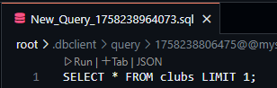

# はじめに
MySQLを使ったSQLや実行計画を学習するためのリポジトリです。

## 利用上の注意
- `Github`の`Codespace`を利用します。`Codespace`は設定によってはコストがかかるものなので [Codespaceの利用上の注意](#Codespaceの利用上の注意) はよく確認してください。

## 使い方
※ ローカルで`docker-compose.yml`を起動する場合は`.env`ファイルのユーザーIDとパスワードを設定してから、起動してください。 ここでは`Codespaces`で起動する方法を記載しています。

1. このリポジトリをフォークするため、右上の`fork`をクリックする 
  
1. フォークが完了すると XXX になる
1. `.env.sample`の内容を設定するために、`Settings`タブ を開きます。 
  
1. 左のメニューから `Secrets and variables` ＞ `Codespaces` を開きます。 
  
1. `new repository Secrets`ボタンをクリックして、3つのシークレットを設定します。 
  
1. `Name`に`MYSQL_ROOT_PASSWORD`と入力して、`Secret`に適当なパスワードを入力します（後ほど使いますのでメモしてください）。 
  
1. `Name`に`MYSQL_PASSWORD`と入力して、`Secret`に適当なパスワードを入力します（後ほど使いますのでメモしてください）。 
  
1. `Name`に`MYSQL_USER`と入力して、`Secret`に適当なユーザーIDを入力します（後ほど使いますのでメモしてください）。 
  
1. シークレットの設定が完了したら以下の画像のようになります。
  
1. シークレット完了後、`Codespace`を起動するため、`Code`タブに移動し、右上にある緑色の`code`のプルダウンメニューを開き、`Codespace`タブを開き、`Create codespace on main`をクリックします。
  
1. `Codespace`の生成にはしばらく時間がかかるため、しばらく待ちます。 
  
1. `VSCode`が起動しますが、画面右下が`リモートを開いています...`の間は待ちます。 
  
1. 画面右下が`Codespace`になった場合は、`VSCode`が起動しました。 
  
1. `MySQL`に接続するため、右側の筒状のアイコンをクリックして`Create connection`をクリックします。（もし、`Create connection`をクリックしても反応が無い場合は、Webブラウザをリロードしてみてください） 
  
1. 画面中央に接続設定が表示されるので`Name`に`mysql`、`Host`に`mysql`、`database`に`mydatabase`、`Username`に`root`と入力する。`Password`に`Secret`の`MYSQL_ROOT_PASSWORD`に設定した値を入力します。 
  
1. `connect`をクリックして`Success!`を確認します 
  
1. `Save`をクリックして接続情報を保存すると、左のパネルに先ほど`Name`で指定した名前で接続情報が保存されます。 
  
1. `Query`の`+`をクリックして適当な名前を付けてクエリの実行ファイルを生成します。 
  
1. 生成したクエリのファイルに適当なSQLを記述してSQLの上部に出てくる`Run`をクリックするとSQLを実行できます。 
  

## ER図

## Codespaceの利用上の注意
- アカウントの種類が個人であり、クレジットカードを登録していない想定です。この条件であれば上限を超過すると使えなくなるだけ（のはず！）です。

### アカウントの確認
- `Github`には`個人アカウント`以外にも`Organization アカウント`と`Enterprise アカウント`があります。
- 画面右上の自分のアカウントをクリックして`Organizations`をクリックして組織が表示されず「Organizations You are not a member of any organizations.」という表示のみであれば個人アカウント 
  
- （追記中）

